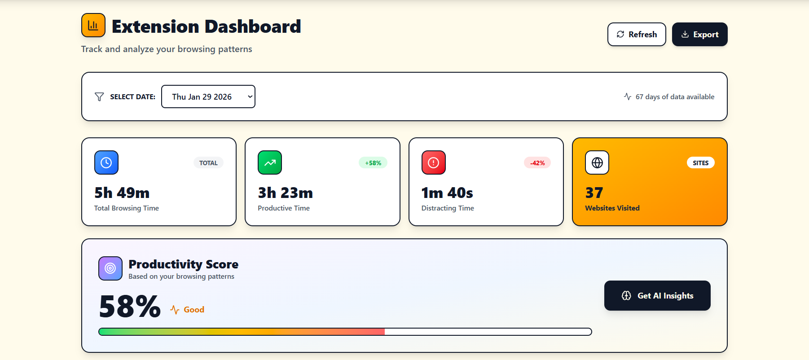
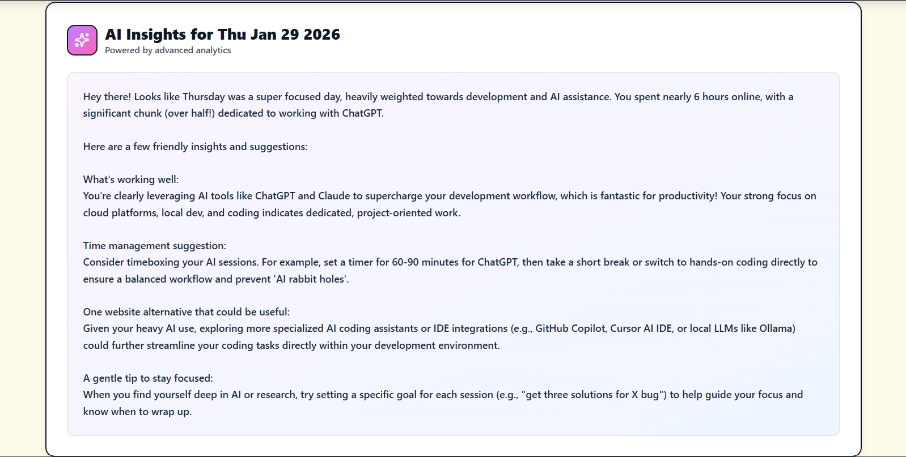
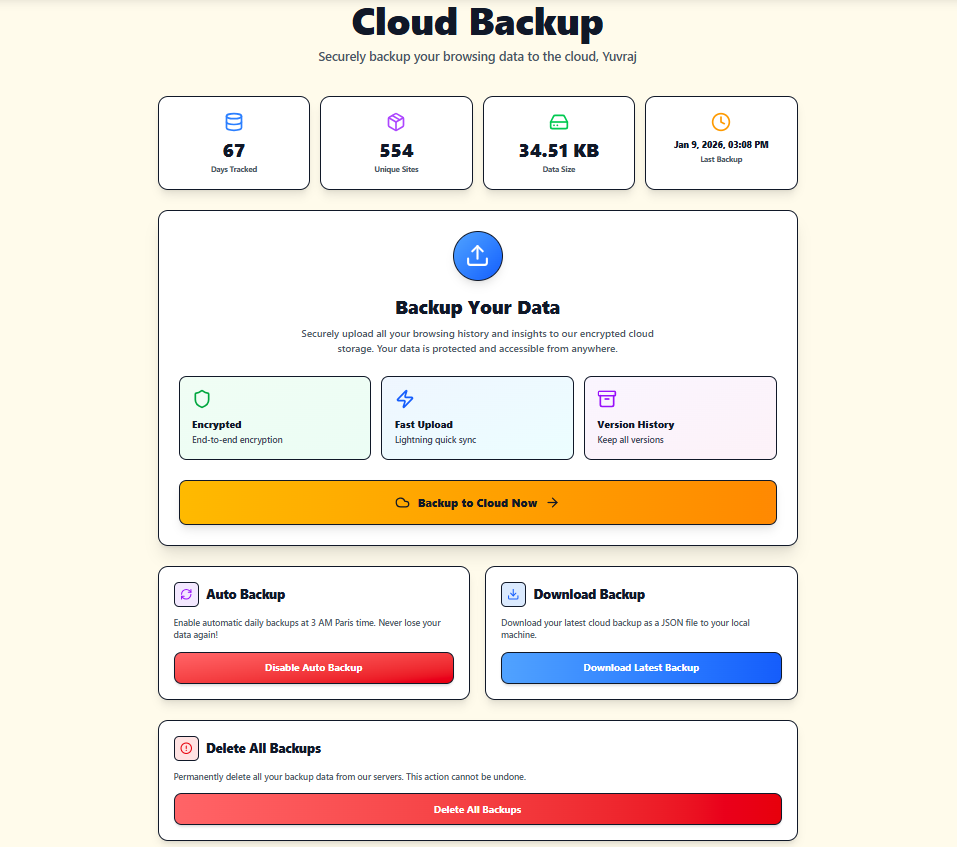

#  mora - Browsing Habits Tracker

<p align="center">
  
</p>

<p align="center">
  <strong>Track your digital time. Reclaim your focus.</strong>
</p>

<p align="center">
  <a href="https://moraextension.pages.dev/"><strong>🚀 View Live Demo</strong></a>
</p>

<p align="center">
  
  
  
  
</p>

---

## 🎯 Overview

Mora is a free, privacy-first web application that transforms raw browsing data into actionable insights. Designed for students, developers, and digital minimalists, Mora helps you understand where your time goes online and provides AI-powered recommendations to boost productivity.

Built by [Yuvraj Karna](https://github.com/yuvrajkarna), Mora bridges the gap between data tracking and meaningful habit change.

---

## ✨ Key Features

### 🔐 **Secure Authentication**
- One-click Google OAuth 2.0 login
- No passwords to remember, no sensitive data stored

### 🛡️ **Privacy First**
- Local-first data principles
- Mandatory privacy policy acceptance
- You control your data

### 🤖 **AI-Powered Insights**
- Personalized productivity recommendations
- Powered by Google Gemini AI via LangChain
- Transform raw metadata into human-readable insights

### 📈 **Data Visualization**
- Clear statistics on your browsing patterns
- Identify time-sinks and productivity blockers
- Track trends over time

### ☁️ **Cloud Backup & Export**
- Securely sync your browsing data
- Export your data anytime
- Never lose your tracking history

---

## 📸 Screenshots

<p align="center">
  
  <br/>
  <em>Your personal productivity dashboard</em>
</p>

<p align="center">
  
  <br/>
  <em>Get actionable AI recommendations</em>
</p>

<p align="center">
  
  <br/>
  <em>Secure cloud sync and export</em>
</p>

---

## 🏗️ Architecture

Mora follows a modern, scalable client-server architecture:

```
┌─────────────────────────────────────────────────────────────┐
│                         Frontend Layer                       │
│  React 18 + Redux Toolkit + Tailwind CSS + Vite            │
└───────────────────────────┬─────────────────────────────────┘
                            │
┌───────────────────────────▼─────────────────────────────────┐
│                        Backend Layer                         │
│  Node.js + Express.js + Passport.js (Google OAuth)          │
└───────────────────────────┬─────────────────────────────────┘
                            │
        ┌───────────────────┼───────────────────┐
        │                   │                   │
┌───────▼────────┐ ┌────────▼────────┐ ┌───────▼──────────┐
│  Intelligence  │ │  Data Storage   │ │    Security      │
│   Layer        │ │                 │ │                  │
│  Google Gemini │ │    Supabase     │ │  Passport.js     │
│  + LangChain   │ │  (PostgreSQL)   │ │  Google OAuth    │
└────────────────┘ └─────────────────┘ └──────────────────┘
```

### Core Components

- **Frontend**: Responsive React application with Redux Toolkit for predictable state management
- **Backend**: Node.js/Express API handling authentication, data processing, and external service communication
- **Intelligence Layer**: Google Gemini AI integration via LangChain for transforming browsing metadata into insights
- **Data Persistence**: Supabase (PostgreSQL) for user profiles, usage history, and secure cloud backups
- **Security**: Passport.js with Google OAuth 2.0 for secure, passwordless authentication

---

## 👥 Who Is This For?

Mora is designed for anyone looking to take control of their digital time:

- **Students & Researchers**: Balance study time and manage deep-work sessions effectively
- **Developers & Professionals**: Identify time-sinks and optimize workflow efficiency
- **Digital Minimalists**: Quantify browsing habits and reduce mindless scrolling
- **Productivity Enthusiasts**: Get data-driven insights to improve focus and time management

---

## 🛠️ Tech Stack

### Frontend
- **React 18**: Modern UI library
- **Redux Toolkit**: State management
- **Tailwind CSS**: Utility-first styling
- **Vite**: Lightning-fast build tool

### Backend
- **Node.js**: JavaScript runtime
- **Express.js**: Web application framework
- **Passport.js**: Authentication middleware

### Database & AI
- **Supabase**: PostgreSQL database with real-time capabilities
- **Google Generative AI (Gemini)**: AI-powered insights
- **LangChain**: AI orchestration framework

---

## 🚀 Quick Start

### Prerequisites

- Node.js (v16 or higher)
- npm or yarn
- Google Cloud Platform account (for OAuth credentials)
- Supabase account
- Google AI API key

### Installation

1. **Clone the repository**
   ```bash
   git clone https://github.com/yuvrajkarna2717/mora.git
   cd Mora
   ```

2. **Install dependencies**
   ```bash
   # Install server dependencies
   cd server
   npm install

   # Install client dependencies
   cd ../client
   npm install
   ```

3. **Environment setup**

   Create a `.env` file in the `/server` directory:
   
   ```env
   PORT=3001
   CLIENT_URL=https://moraextension.pages.dev
   
   # Google OAuth 2.0
   GOOGLE_CLIENT_ID=your_google_client_id
   GOOGLE_CLIENT_SECRET=your_google_client_secret
   
   # Google AI
   GOOGLE_API_KEY=your_gemini_api_key
   
   # JWT
   JWT_SECRET=your_jwt_secret
   
   # Supabase
   SUPABASE_URL=your_supabase_url
   SUPABASE_ANON_KEY=your_supabase_anon_key
   ```

4. **Run the application**

   ```bash
   # Start the backend server (from /server directory)
   npm start

   # In a new terminal, start the frontend (from /client directory)
   npm run dev
   ```

5. **Access the application**

   Open your browser and navigate to `http://localhost:5173` (or the port Vite assigns)

---

## 📝 Configuration

### Setting up Google OAuth

1. Go to [Google Cloud Console](https://console.cloud.google.com/)
2. Create a new project or select an existing one
3. Enable the Google+ API
4. Create OAuth 2.0 credentials
5. Add authorized redirect URIs
6. Copy your Client ID and Client Secret to the `.env` file

### Setting up Google AI (Gemini)

1. Visit [Google AI Studio](https://makersuite.google.com/app/apikey)
2. Generate an API key
3. Add the key to your `.env` file as `GOOGLE_API_KEY`

### Setting up Supabase

1. Create a new project at [Supabase](https://supabase.com/)
2. Copy your project URL and anon key
3. Add them to your `.env` file
4. Set up your database schema (see `/server/database/schema.sql` if provided)

---

## 🌟 Features In Detail

### Privacy-First Approach
- All sensitive data is encrypted
- Browsing data stays local unless you choose to sync
- Transparent data handling with mandatory privacy policy acceptance

### AI-Powered Recommendations
- Analyzes your browsing patterns
- Identifies productivity blockers
- Suggests actionable improvements
- Learns from your habits over time

### Comprehensive Analytics
- Time spent per website
- Category-based analysis
- Daily, weekly, and monthly trends
- Productivity score tracking

---

## 🤝 Contributing

Contributions are welcome! Here's how you can help:

1. Fork the repository
2. Create a feature branch (`git checkout -b feature/AmazingFeature`)
3. Commit your changes (`git commit -m 'Add some AmazingFeature'`)
4. Push to the branch (`git push origin feature/AmazingFeature`)
5. Open a Pull Request

---

## 📄 License

This project is licensed under the MIT License - see the [LICENSE](LICENSE) file for details.

---

## 👨‍💻 Author

**Yuvraj Karna**

- GitHub: [@yuvrajkarna2717](https://github.com/yuvrajkarna2717)
- Email: [support@mora-app.com](mailto:yuvrajkarna.code@gmail.com)

---

## 🙏 Acknowledgments

- Google Gemini AI for powering intelligent insights
- Supabase for reliable database infrastructure
- The open-source community for amazing tools and libraries

---

## 📞 Support

- **Issues**: [GitHub Issues](https://github.com/yuvrajkarna2717/mora/issues)
- **Email**: [support@mora-app.com](mailto:yuvraj.code@gmail.com)
- **Live Demo**: [https://moraextension.pages.dev/](https://moraextension.pages.dev/)

---

<p align="center">
  Made with ❤️ by <a href="https://github.com/yuvrajkarna">Yuvraj Karna</a>
</p>

<p align="center">
  <strong>Star ⭐ this repository if you find it helpful!</strong>
</p>